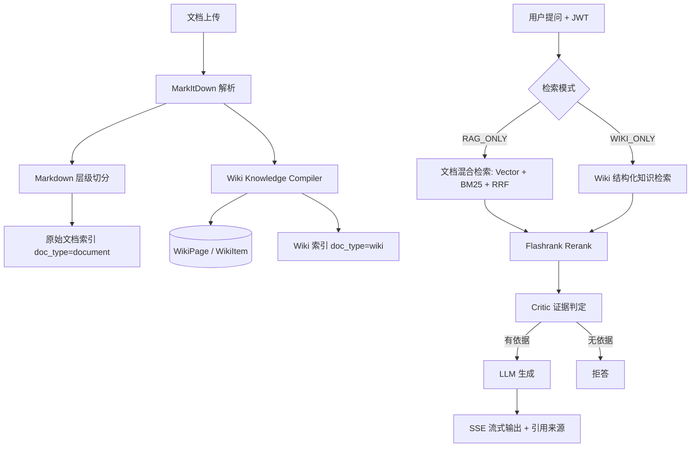

# Enterprise RAG / 企业 AI 知识工作台

<p align="center">
  <a href="https://www.python.org/"></a>
  <a href="https://fastapi.tiangolo.com/"></a>
  <a href="https://github.com/langchain-ai/langchain"></a>
  <a href="https://www.postgresql.org/"></a>
</p>

> 面向企业私有文档场景的 **RAG + Wiki 双模 AI 知识工作台**。系统在传统文档问答链路之外，新增 Wiki Knowledge Compiler，将上传文档自动编译为结构化摘要、核心概念、关键条款与 FAQ，并保留原文引用来源。

---

## 1. 项目定位

普通 RAG 系统通常只能完成“上传文档后问答”：

```text
文档 -> 切分 -> 向量化 -> 检索 -> 生成回答
```

本项目在此基础上增加了一层 **知识编译能力**：

```text
文档上传
  ├─ RAG Pipeline：切分、向量化、BM25、RRF、Rerank、引用问答
  └─ Wiki Pipeline：LLM 编译摘要、概念、条款、FAQ、原文依据

用户提问
  ├─ RAG_ONLY：查原文细节、政策条款、具体参数
  └─ WIKI_ONLY：查文档总结、概念解释、结构化知识
```

它不是单纯的聊天 Demo，而是一个可演示、可部署、可评测、可被 Agent 调用的企业知识服务层。

---

## 2. 解决的问题

1. **企业文档分散，检索效率低**：通过统一上传、解析、切分、检索和问答入口，降低查资料成本。
2. **长文档阅读负担重**：上传后自动生成 Wiki 页面，快速沉淀摘要、核心概念、关键条款和 FAQ。
3. **回答缺少依据**：RAG 回答和 Wiki 条目均保留引用来源，便于人工复核和审计。
4. **跨租户数据泄露风险**：后端基于 JWT 解析 `tenant_id`，并在 Chroma、BM25、PostgreSQL 查询中绑定租户信息。
5. **模型幻觉风险**：生成前使用 Critic Agent 判断上下文是否足以回答，不足时触发拒答。

---

## 3. 核心功能

### 3.1 RAG 原文问答

- MarkItDown 文档解析
- Markdown 层级切分 + RecursiveCharacterTextSplitter
- Chroma 向量检索
- BM25 关键词检索
- RRF 融合排序
- Flashrank Rerank 精排
- Query Rewriting 多轮问题改写
- Critic Agent 证据判定与拒答
- SSE 流式输出
- 引用来源返回

### 3.2 Wiki Knowledge Compiler

上传文档后，后台任务调用 LLM 自动生成 Wiki 页面：

- 文档摘要 `summary`
- 核心概念 `concepts`
- 关键条款 `clauses`
- 典型问答 `faqs`
- 每个条目的原文依据 `citation`

工程保护：

- 仅截取前 30,000 字符参与 Wiki 编译，避免 token 爆量
- LLM 输出 JSON 解析失败时自动降级生成基础 Wiki
- Wiki 编译失败不影响原始 RAG 入库
- Wiki 数据写入 PostgreSQL，并以 `doc_type="wiki"` 写入检索索引

### 3.3 检索模式

目前支持两种模式：

| 模式 | 适用场景 | 数据来源 |
| :--- | :--- | :--- |
| `RAG_ONLY` | 查原文细节、制度条款、产品参数 | `doc_type=document` 原始文档分片 |
| `WIKI_ONLY` | 查文档总结、概念解释、FAQ | `doc_type=wiki` 编译后的 Wiki 分片 |

> `RAG + Wiki` 双路混合召回可作为后续升级方向，目前项目优先保证两种单路模式稳定可用。

### 3.4 多租户隔离

- 登录后端签发 JWT，后端从 Token 中解析 `tenant_id` 与 `user_id`
- Chroma 检索强制加入 `tenant_id` metadata filter
- BM25 检索器按租户独立持久化为 `data/bm25_{tenant_id}.pkl`
- 文档、会话、Wiki 查询均在 SQL 层绑定 `tenant_id`
- Wiki 详情接口通过 `document_id + tenant_id` 防止横向越权

### 3.5 MCP-ready 工具接口

系统提供面向 Agent / IDE 的工具化接口，并通过 `mcp_server/server.py` 暴露 stdio MCP 服务。

可调用工具：

- `search_documents(query, top_k)`：检索当前租户文档分片
- `get_document_detail(doc_id)`：查询文档详情并校验权限
- `answer_with_citations(question)`：非流式带引用问答
- `list_documents()`：列出租户可访问文档

---

## 4. 系统架构



---

## 5. 数据模型

### `DocumentRecord`

记录上传文档的租户、用户、文件名、文件哈希和创建时间。

### `WikiPage`

一篇文档对应一个 Wiki 页面：

- `tenant_id`
- `user_id`
- `document_id`
- `title`
- `summary`
- `markdown_content`

### `WikiItem`

记录 Wiki 中的结构化条目：

- `category`: `concept` / `clause` / `faq`
- `key`: 概念名、条款名或问题
- `value`: 定义、条款内容或回答
- `citation`: 原文依据片段

---

## 6. API 概览

### 认证与文档

- `POST /api/v1/auth/register`
- `POST /api/v1/auth/login`
- `POST /api/v1/auth/visitor-login`
- `POST /api/v1/upload`
- `GET /api/v1/list`
- `DELETE /api/v1/document`

### 问答

- `POST /api/v1/chat`
  - `message`: 用户问题
  - `session_id`: 会话 ID
  - `search_mode`: `RAG_ONLY` / `WIKI_ONLY`

### Wiki

- `GET /api/v1/wiki/list`
- `GET /api/v1/wiki/detail?document_id=xxx`

### Tools / MCP

- `POST /api/v1/tools/search_documents`
- `POST /api/v1/tools/get_document_detail`
- `POST /api/v1/tools/answer_with_citations`
- `GET /api/v1/tools/list_documents`
- `POST /api/v1/tools/evaluate_answer`

---

## 7. 前端能力

前端提供三类主要视图：

1. **智能问答**：支持 RAG / Wiki 模式切换、SSE 流式回答、引用来源展示。
2. **知识 Wiki**：展示已编译 Wiki 文档、摘要、核心概念、关键条款与 FAQ。
3. **开发者调试面板**：展示检索链路、健康状态、引用片段与调试信息。

---

## 8. 评测与结果

基于《星耀科技 2024 年度产品与员工手册》构建了 15 条人工评测集，覆盖：

- 基础事实抽取
- 条件过滤理解
- 数值计算推理
- 跨段落综合
- 拒答防幻觉

当前记录：

| 指标 | 优化前 | 优化后 | 说明 |
| :--- | :---: | :---: | :--- |
| 人工评估准确率 | 73.3% | 86.7% | Critic Prompt 与 Rerank Top-K 调整 |
| Faithfulness | 0.5426 | 0.6767 | RAGAS 自动评估指标 |
| Answer Relevancy | 0.2647 | 0.3590 | RAGAS 自动评估指标 |
| Context Recall | 1.0000 | 0.9333 | RAGAS 自动评估指标 |

详细报告：

- `docs/evaluation_report.md`
- `docs/ragas_report.md`

---

## 9. 已知边界

1. **不适合全量统计**：如“所有合同中某条款出现多少次”，更适合 SQL、搜索引擎或结构化索引。
2. **不替代人工决策**：涉及法律、财务、医疗等高风险问题时，需要人工复核。
3. **Wiki 编译依赖 LLM 输出质量**：已做 JSON 解析兜底，但自动摘要仍需人工审阅。
4. **当前未实现完整 GraphRAG**：跨文档实体关系推理仍是后续方向。
5. **当前未实现 RAG + Wiki 双路并发融合**：现阶段优先保证 `RAG_ONLY` 和 `WIKI_ONLY` 两种模式稳定。

---

## 10. 本地启动

### 10.1 环境变量

复制 `.env.example` 为 `.env`，配置模型 API、数据库和 JWT 密钥。

### 10.2 Docker Compose

```bash
docker compose up --build -d
```

默认服务：

- 前端：`http://localhost:5178`
- 后端：`http://localhost:8010`
- API Docs：`http://localhost:8010/docs`

### 10.3 本地开发

后端：

```bash
uvicorn main:app --reload --port 8010
```

前端：

```bash
cd frontend
npm install
npm run dev
```

---

## 11. MCP 挂载示例

### Cursor

```text
Name: Enterprise-RAG-MCP
Type: command
Command: python d:/Rag/Enterprise_RAG/mcp_server/server.py
Environment:
  RAG_BASE_URL=http://localhost:8010/api/v1/tools
  RAG_JWT_TOKEN=<你的 JWT Token>
```

### Claude Desktop

```json
{
  "mcpServers": {
    "enterprise-rag-mcp": {
      "command": "python",
      "args": ["d:/Rag/Enterprise_RAG/mcp_server/server.py"],
      "env": {
        "RAG_BASE_URL": "http://localhost:8010/api/v1/tools",
        "RAG_JWT_TOKEN": "<你的 JWT Token>"
      }
    }
  }
}
```

---

## 12. 测试

当前已有测试：

```bash
python -m pytest tests/test_api_flows.py tests/test_tools_api.py -q
```

覆盖内容包括：

- 注册、登录、访客登录
- 文档上传与删除
- 多租户历史隔离
- 工具 API 鉴权
- 横向越权拦截
- 无答案拒答
- LLM 评估降级

> Wiki 工作流建议后续补充 `tests/test_wiki_workflow.py`，覆盖 WikiPage / WikiItem 创建、JSON 解析失败降级、`RAG_ONLY` / `WIKI_ONLY` 检索过滤。

---

## 13. 简历表达建议

> 设计并实现企业 AI 知识工作台，支持文档解析、Markdown 层级切分、向量 + BM25 混合检索、RRF 融合、Flashrank 重排、Critic Agent 拒答、SSE 流式问答与引用溯源；在传统 RAG 原文检索基础上，新增 Wiki Knowledge Compiler，将上传文档自动编译为摘要、核心概念、关键条款和 FAQ，并基于 JWT 与 tenant_id metadata filter 实现多租户逻辑隔离，同时提供 MCP-ready 工具接口供 IDE Agent 调用。

---

## 14. 后续计划

- 补充 Wiki 工作流测试
- 增加 Wiki 重新生成接口
- 增加 RAG + Wiki 双路召回融合
- 引入 ParentDocumentRetriever 解决跨段落召回问题
- 对接更完善的线上 Trace 与监控
