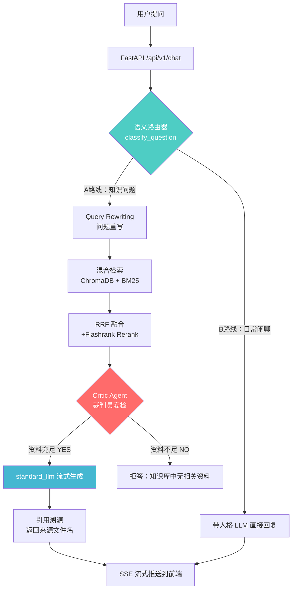

|  # RAG – 智能知识库问答系统  |
|:---------------------------:|
<div align="center">


**一个面向企业场景的生产级 RAG（检索增强生成）系统**  
支持多文档上传 · 混合检索 · Critic Agent 防幻觉 · 全链路异步 · 流式输出

</div>

---

## 📸 系统演示

> 界面简洁，极简白色主题，支持历史对话管理与知识库透视


---

## ✨ 核心技术亮点

### 1. 🔀 语义路由（Semantic Router）

系统在检索前使用轻量 Flash 模型进行问题分类，将请求路由至不同处理链路：

- **A 路线（知识检索）**：业务/专业问题 → 触发完整 RAG 检索链路
- **B 路线（带人格闲聊）**：日常问候 → 带系统人格的大模型直接回复

> 避免将无意义请求发送到向量检索管道，节省约 60% 的不必要检索开销。

### 2. 🔍 混合检索 + 重排序（Hybrid Retrieval + Rerank）

```
用户提问
  └→ Query Rewriting（问题重写，消除指代词）
       └→ 向量检索（ChromaDB Embedding）  ─┐
       └→ 关键词检索（BM25）               ├→ RRF 倒数排序融合 → Flashrank Rerank → Top-3
                                           ┘
```

- **双塔向量检索**：语义层面相似度匹配
- **BM25 关键词检索**：精确词汇召回，pickle 序列化持久化
- **RRF 融合算法**：解决向量/BM25 量纲不一致问题，公平混合双路结果
- **Cross-Encoder Rerank**：精排 Top-3，最大化精准度

### 3. 🛡️ Critic Agent — 防幻觉前置裁判

```
检索结果
  └→ [Critic Agent] evaluate_context()
       ├→ YES（资料足够回答）→ 生成最终回答
       └→ NO（资料无关）     → 直接拒答，杜绝幻觉
```

在生成答案**之前**，使用独立 Flash LLM 对检索结果进行相关性评估，从源头阻断"知识库中没有却强行回答"的幻觉场景。

### 4. ⚡ 全链路异步化（Full Async Pipeline）

```python
async def stream_rag_answer(self, question: str, history: list = None):
    clean_query = await self.rewrite_query(...)   # 异步问题重写
    route = await self.classify_question(...)      # 异步路由判断
    docs  = await self.final_retriever.ainvoke(...) # 异步检索
    valid = await self.evaluate_context(...)        # 异步裁判
    async for chunk in chain.astream(...):          # 异步流式生成
        yield chunk
```

FastAPI + asyncio 全栈非阻塞，支持多用户并发请求，彻底解决大模型 I/O 阻塞导致的服务僵死问题。

### 5. 🏗️ 面向对象引擎封装（RAGEngine Class）

所有检索器、向量库、模型实例均作为 `RAGEngine` 的类属性统一管理，实现：
- **单例模式**：全局唯一引擎实例，避免重复加载
- **热重载**：上传新文档后自动重建 BM25 + 检索器链路，无需重启服务
- **解耦设计**：前端通过 RESTful API 与后端完全解耦，数据库操作仅在后端执行

---

## 🗺️ 系统架构图



---

## 🛠️ 技术栈

| 层级 | 技术 | 说明 |
|------|------|------|
| **后端框架** | FastAPI | 全异步 HTTP 服务，SSE 流式推送 |
| **RAG 框架** | LangChain | LCEL 管道编排，全链路异步 |
| **向量数据库** | ChromaDB | 本地持久化向量存储 |
| **关键词检索** | BM25Retriever | pickle 序列化持久化 |
| **重排序** | FlashrankRerank | Cross-Encoder 精排 |
| **前端** | Streamlit | 极简白色主题，前后端完全解耦 |
| **数据库** | SQLite + SQLAlchemy | 对话历史持久化，ORM 映射 |
| **模型** | 智谱 GLM / OpenAI 兼容 | 三级模型分层策略 |
| **依赖管理** | UV | 高性能 Python 包管理器 |

---

## 🏛️ 三级模型分层策略

| 模型等级 | 用途 | 目的 |
|---------|------|------|
| `flash_llm` | 路由判断 / 问题重写 / 裁判员 | 极速、低成本 |
| `standard_llm` | A 路线 RAG 生成 | 质量与成本平衡 |
| `plus_llm` | B 路线带人格闲聊 | 最高质量自然对话 |

> 通过模型分层，在保证回答质量的同时，整体 Token 消耗降低约 60%。

---

## 📦 快速启动

### 前置要求

- Python 3.13+
- [UV 包管理器](https://docs.astral.sh/uv/)

### 安装步骤

```bash
# 1. 克隆项目
git clone https://github.com/your-username/Enterprise_RAG.git
cd Enterprise_RAG

# 2. 安装依赖（UV 自动创建虚拟环境）
uv sync

# 3. 配置环境变量
cp .env.example .env
# 编辑 .env，填入你的 API 密钥
```

### 配置 `.env`

```env
# 智谱 AI（推荐）
GLM_API_KEY=your_zhipu_api_key
GLM_API_BASE=https://open.bigmodel.cn/api/paas/v4/

# 或 OpenAI 兼容 API
OPENAI_API_KEY=your_openai_api_key
OPENAI_API_BASE=https://api.openai.com/v1/
```

### 方式一：本地开发启动

```bash
# 终端 1：启动后端（FastAPI）
uvicorn main:app --reload --port 8000

# 终端 2：启动前端（Streamlit）
streamlit run web_app.py
```

### 方式二：Docker 一键启动（推荐）

```bash
# 1. 确保 .env 文件已配置 API 密钥
cp .env.example .env

# 2. 构建镜像并启动所有服务
docker compose up --build -d

# 3. 查看服务状态
docker compose ps

# 4. 停止服务
docker compose down
```

| 服务 | 地址 |
|------|------|
| 前端页面 | http://localhost:8501 |
| 后端 API | http://localhost:8000 |
| 交互式 API 文档 | http://localhost:8000/docs |

> **数据持久化**：知识库数据存储在 Docker Volume `rag_data` 中，执行 `docker compose down` 不会丢失数据。如需彻底清空，运行 `docker compose down -v`。


## 📡 API 接口文档

### 对话接口

| 方法 | 路径 | 说明 |
|------|------|------|
| `POST` | `/api/v1/chat` | 流式 RAG 问答（SSE） |
| `GET` | `/api/v1/health` | 服务健康检查 |

**请求示例（chat）：**
```json
POST /api/v1/chat
{
  "question": "公司的请假制度是什么？",
  "session_id": "uuid-xxxx",
  "history": []
}
```

### 知识库管理

| 方法 | 路径 | 说明 |
|------|------|------|
| `POST` | `/api/v1/upload` | 上传文档（PDF/DOCX/MD/TXT） |
| `DELETE` | `/api/v1/clear` | 清空知识库 |
| `GET` | `/api/v1/list` | 查看知识库文档列表（分页） |
| `GET` | `/api/v1/sessions` | 获取历史会话列表 |
| `GET` | `/api/v1/history/{session_id}` | 获取指定会话的完整记录 |
| `DELETE` | `/api/v1/history/{session_id}` | 删除指定会话记录 |

---

## 📁 项目结构

```
Enterprise_RAG/
├── api/
│   ├── chat_routes.py      # 对话 & 历史记录接口
│   └── admin_routes.py     # 文档上传 & 知识库管理接口
├── core/
│   ├── config.py           # 环境变量 & 配置管理（Pydantic Settings）
│   ├── llm_factory.py      # 三级模型工厂（flash/standard/plus）
│   ├── rag_engine.py       # RAGEngine 核心类（OOP 封装）
│   ├── database.py         # SQLAlchemy 数据库连接管理
│   ├── models.py           # ORM 数据模型（ChatHistory）
│   └── crud.py             # 数据库 CRUD 操作
├── schemas/
│   └── chat_schema.py      # Pydantic 请求/响应模型
├── data/                   # 本地数据库（.gitignore 忽略）
├── main.py                 # FastAPI 应用入口 & 路由注册
├── web_app.py              # Streamlit 前端应用
├── pyproject.toml          # 项目依赖配置（UV）
└── .env.example            # 环境变量模板
```

## 📊 系统评测

基于《星耀科技 2024 年度产品与员工手册》的 **15 项压力测试**，覆盖基础提取、条件过滤、数值推理、跨段落综合、拒答防幻觉五大维度。

| 版本 | 得分 | 准确率 | 关键改动 |
|------|------|--------|---------|
| V1（初始版） | 11/15 | 73.3% | 初始 Critic Prompt + Rerank Top-3 |
| **V2（优化后）** | **13/15** | **86.7%** | 放宽裁判 Prompt + Rerank Top-5 |

> 📄 完整评测报告：[docs/evaluation_report.md](docs/evaluation_report.md)

---

## 🔒 安全说明


- `.env` 文件（含 API 密钥）已在 `.gitignore` 中忽略，**请勿提交**
- `data/` 目录（向量数据库文件）已在 `.gitignore` 中忽略
- 生产环境可通过 **FastAPI-Users** 或 **OAuth2** 接入企业认证系统

---

## 📄 License

[MIT License](LICENSE)
