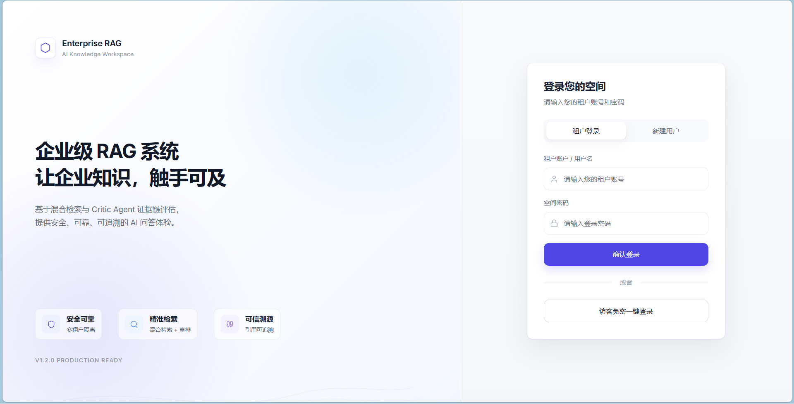
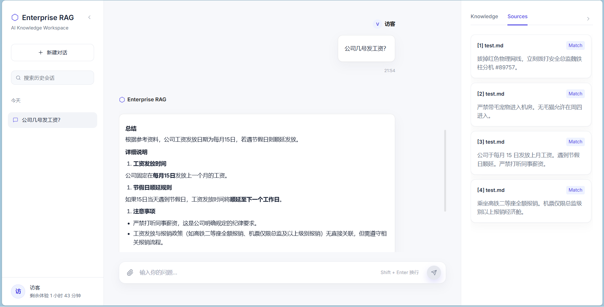
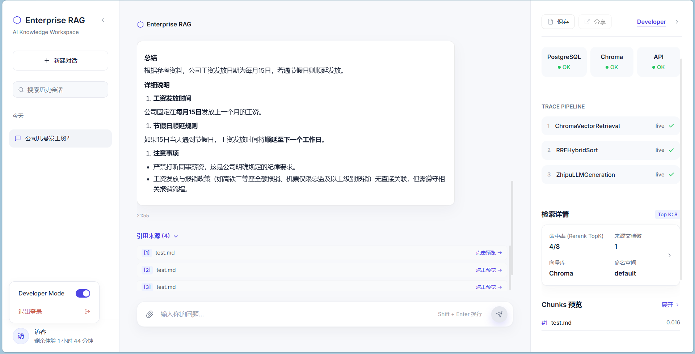
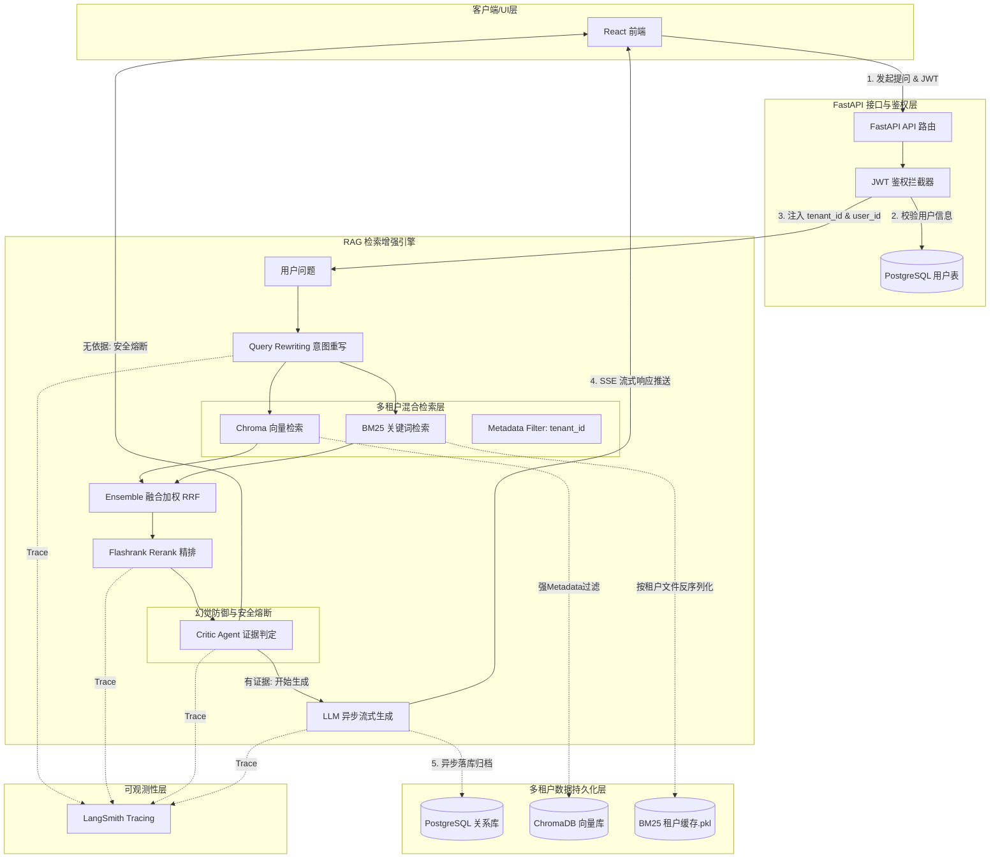

<h1 align="center">Enterprise RAG 企业级安全多租户 RAG 系统</h1>

<p align="center">
  <a href="https://www.python.org/"></a>
  <a href="https://fastapi.tiangolo.com/"></a>
  <a href="https://github.com/langchain-ai/langchain"></a>
  <a href="https://react.dev/"></a>
  <a href="https://www.postgresql.org/"></a>
</p>

基于 **FastAPI + React + ChromaDB + Flashrank Rerank + PostgreSQL** 构建的准生产级、企业多租户 RAG（检索增强生成）问答系统。项目通过 JWT 鉴权结合向量/关键词物理隔离、Critic Agent 防幻觉拒答、RAGAS 评测闭环及 LangSmith 监控，构建了一个**“可观测、可评测、可部署、可验证”**的完整工程闭环。

---

## ✨ 简历直通：项目亮点卡片 (Highlights)

| 维度 | 核心内容 | 证据/实现链接 |
| :--- | :--- | :--- |
| **技术亮点 1** | **租户级逻辑与向量双重隔离**：基于 JWT 认证在后端强绑定 `tenant_id`，利用 Chroma 字段级 Metadata 过滤结合按租户独立持久化 BM25 检索器（`bm25_{tenant}.pkl`），实现毫秒级响应下的数据隔离。 | [查看数据流与代码](#第三页-系统架构与多租户隔离数据流-architecture--data-flow) |
| **技术亮点 2** | **Critic Agent 证据判定与防幻觉**：引入前置证据判定 Agent (arXiv:2309.15217)，对混合检索 Top-K 上下文进行证据链评估，对于无关或超纲问题触发 **100% 安全拒答**，显著降低大模型幻觉。 | [查看防幻觉机制](#第一页-项目结论-project-verdict--outcomes) |
| **技术亮点 3** | **无状态 JWT SSO 鉴权与后端历史加载**：屏蔽前端传入的历史聊天记录，强制在后端通过 PostgreSQL 强绑定 `tenant_id + user_id` 进行历史加载，防御会话伪造攻击，并提供访客租户物理数据定期自动清理机制。 | [查看安全防线](#第三页-系统架构与多租户隔离数据流-architecture--data-flow) |
| **量化指标 1** | **评测准确率提升 13.4%**：通过放宽 Critic 推理边界和 Rerank Top-5 调优，人工评测集准确率由 **73.3% 提升至 86.7%**。 | [查看人工评测报告](docs/evaluation_report.md) |
| **量化指标 2** | **回答忠实度提升 24.7%**：RAGAS 自动化评测结果显示，优化后生成回答的 **Faithfulness (忠实度) 指标达 0.6767**，Context Recall 达 0.9333。 | [查看RAGAS自动化报告](docs/ragas_report.md) |
| **架构与截图**| 完整还原了新版 React 前端的 [登陆系统](docs/登陆系统.png)、[用户模式](docs/用户模式.png)、[开发者模式](docs/开发者模式.png) 以及自动化打分生成的 [评测结果截图](test_result.webp) 视觉印证。 | [查看系统架构图](#第三页-系统架构与多租户隔离数据流-architecture--data-flow) |

### 🖥️ 新版 React 前端运行截图展示

<table>
  <tr>
    <td align="center"><b>多租户登陆系统</b><br/></td>
  </tr>
  <tr>
    <td align="center"><b>用户问答模式</b><br/></td>
  </tr>
  <tr>
    <td align="center"><b>开发者调试模式 (RAG Trace & 检索中间件)</b><br/></td>
  </tr>
</table>

---

## 第一页：项目结论 (Project Verdict & Outcomes)

### 1. 痛点问题
在企业落地 RAG 系统时，通常面临三大痛点：
- **租户越权与数据泄露**：多部门/多租户共用同一个知识库，如何避免向量相似度检索跨部门召回敏感数据？
- **事实幻觉与编造危害**：在知识库证据不足或用户恶意提问时，模型如何做到不胡言乱语、安全拒答？
- **缺乏衡量证据与评测手段**：系统是“能用”还是“好用”？缺乏客观量化指标支撑项目优化。

### 2. 关键工程决策
- **决策一：JWT 拦截绑定 + Chroma/BM25 字段双重物理隔离**
  - *理由*：传统的按目录隔离不适合高并发，本系统在 JWT 鉴权解析出 `tenant_id` 后，不仅在 Chroma 检索时强加入 Metadata 过滤，而且按租户将 BM25 检索器序列化存盘，从底层保证了向量与文本检索的强隔离。
- **决策二：混合检索 (Ensemble) + 结果重排 (Rerank) 级联架构**
  - *理由*：向量检索擅长捕捉语义，但对“Nova Pro”、“5ATM”等专有名词或参数检索不敏感；BM25 刚好相反。利用 RRF 融合两者并使用 Flashrank 轻量重排，可从高维空间将高价值片段精排前移。
- **决策三：Critic Agent 拒答防线**
  - *理由*：在 LLM 生成回答前，使用轻量大模型对重排后的 Top-5 上下文进行客观“证据匹配度校验”。一旦判定为无支撑依据，则直接熔断生成，由系统安全拒答。
- **决策四：零外部网络依赖的离线 CI/CD 集成测试**
  - *理由*：由于大模型 API 调用昂贵且网络易波动，系统使用 `unittest.mock` 屏蔽真实大模型和 Chroma 交互，实现了零成本、100% 离线覆盖业务主流程的集成测试。

### 3. 最终量化价值
- 经过检索链路调优后，系统对 15 问典型基准压测集的人工准确率从 **73.3% 提升至 86.7%**。
- RAGAS 自动打分表明，系统生成回答的 **Faithfulness（忠实度）达到 0.6767**。对不相关/超纲问题实现了 **100% 安全拒答**，杜绝了事实幻觉。

---

## 第二页：评测方法与学术基准 (Evaluation Methodology & Benchmarks)

### 1. 测试集构建
基于《星耀科技 2024 年度产品与员工手册》（共四章，涉及智能设备 Nova Pro/Lite 参数、双11促销与老用户退款政策、保修服务及差旅报销标准），构建了 15 条覆盖各种难度的经典测试基准（位于 `eval/ragas_dataset.json`）：
- **基础提取能力**（如手表定价、材料表面）；
- **条件过滤理解**（如防水保修限制、老用户双11退货资格判定）；
- **数值计算推理**（如老用户折上折价格计算、差旅补贴及餐饮计算）；
- **拒答防幻觉**（如询问原装表带颜色等文档未提及信息）。

### 2. 学术指标应用：Correctness vs. Faithfulness
在严肃的企业级 RAG 应用中，学术界指出：**“回答得有依据(Faithfulness)”的优先级显著高于“猜中答案(Correctness)”**：
- **Faithfulness (忠实度)**（根据 Ragas 论文 [arXiv:2309.15217](https://arxiv.org/abs/2309.15217)）：衡量生成的 Answer 是否完全被 Context 包含。如果 Answer 包含了 Context 未提及的信息，即使答案是对的，也被判定为幻觉行为。
- **Context Grounding (归因度)**（根据 RAG 归因研究 [arXiv:2412.18004](https://arxiv.org/abs/2412.18004)）：衡量模型的回答是否能够被溯源至具体的检索引用来源。
- *系统实践*：系统通过引入前置 Critic 评估机制，对于“原装表带颜色”等未提及问题予以**主动拒答**（Faithfulness 得分 1.0/拒答成功），这在传统评测中被归为“未回答(Correctness=0)”，但在工业应用中却是**安全防线的最优决策**。

### 3. 优化前后评测指标对比

| 指标 (Metrics) | 优化前 (V1) | 优化后 (V2) | 核心变动与优化逻辑 |
| :--- | :---: | :---: | :--- |
| **人工评估准确率** | 73.3% | **86.7%** | 放宽 Critic 推理边界并引入 Rerank Top-5 混合检索 |
| **Faithfulness (忠实度)** | 0.5426 | **0.6767** | Critic 拒绝在没有上下文来源的情况下生成回答 |
| **Answer Relevancy (答案相关性)** | 0.2647 | **0.3590** | 精简回答模板，避免模型啰嗦，直奔问题核心意图 |
| **Context Recall (上下文召回率)** | 1.0000 | **0.9333** | Rerank 从 Top-3 扩展到 Top-5，虽然召回略低但噪音减少 |

> 📊 完整数据记录见 [人工评测报告](docs/evaluation_report.md) 和 [RAGAS 自动化评测报告](docs/ragas_report.md)。

---

## 第三页：系统架构与多租户隔离数据流 (Architecture & Data Flow)

### 1. RAG 核心流水线与多租户架构图


### 2. 租户级数据隔离实现
- **向量隔离**：写入与检索时强加入元数据 `tenant_id` 过滤字典 `{"tenant_id": tenant_id}`，从 Chroma 底层保证查询完全处于当前租户的分支下。
- **关键词隔离**：BM25 检索器不共享，系统将分词索引持久化为独立的本地文件 `data/bm25_{tenant_id}.pkl`，检索时按需反序列化。
- **历史记录隔离**：每次进行查询和删除时，在 SQL 查询中强绑定 `tenant_id + user_id`，规避租户内部越权与串色。

### 3. 多租户生命周期与安全审计
- **访客租户自动清理**：系统包含自动运行的后台线程任务 `cleanup_expired_temporary_visitors()`。针对未注册直接点击“访客登录”体验的过期租户，系统将定时自动清除其在 PostgreSQL、Chroma 向量库及 BM25 持久化文件中的全部物理数据，实现“无痕回收”。
- **越权防御阻断**：
  - **物理文件名净化**：剥离用户上传文件名中的 `../` 目录前缀，由 `uuid.uuid4().hex` 重新生成物理名，防止目录穿越覆写。
  - **绝对路径校验**：在访问 CSV/TXT 文件时，利用 `Path.resolve().is_relative_to` 强校验其是否完全包含在当前租户的沙箱目录下，拒绝通过路径跳转读取敏感系统文件。
  - **屏蔽前端 History**：不信任前端请求体内传递的历史上下文（以防注入篡改），聊天历史一律由后端从关系型数据库物理表中进行加载并按 `limit=5` 进行上下文组装。

---

## 第四页：典型失败案例与技术演进 (Failure Cases & Evolutions)

在工程落地中，我们坦诚分析了评测集中的 **2 个丢分坏用例 (Bad Cases)**：

### 1. Bad Cases 剖析

#### Case A: Q6 跨段落数值推理失败
- *问题*：普通用户在双11购买 Nova Pro (降价 300 元) 加一条真皮表带 (199 元)，总共多少钱？
- *原因分析*：促销降价条款在手册的“第二章（促销政策）”，真皮表带的价格在“第一章（产品线概览）”。由于系统的分块策略为 `chunk_size=300`，这两部分内容被物理割裂到了两个完全不同的分块中。混合检索仅召回了其中一个分块，由于上下文缺乏真皮表带的价格信息，大模型证据判定未通过或无数据计算拒答。

#### Case B: Q12 老用户双11退货策略漏判
- *问题*：老用户购买 Nova Lite 在双11下单后可以 7 天无理由退货吗？
- *原因分析*：老用户的折扣机制在手册第一章/第二章，而退换政策在第三章。因为老用户折扣的退换限制（老用户折扣订单不享受7天退货）在语义表达上比较分散，向量检索仅召回了常规退换政策分块，漏判了老用户这一限定条件。

### 2. 根因分析
这两个案例的根因是 RAG 中非常经典的**分块边界割裂问题**。基于 Token 数量的粗暴文本切分（Token-based Chunking）会导致强关联的上下文被割裂在两个甚至多个不同的分块中，导致向量召回无法同时覆盖它们。

### 3. 技术演进方案
为了解决这一长程跨段落检索瓶颈，我们计划在下一阶段进行以下架构升级：
1. **引入 ParentDocumentRetriever (父子分块检索)**
   - *方案*：把文本切分为较小的子分块（如 `chunk_size=100`）以保障精准的向量检索匹配度，但在检索命中后，通过 ID 自动映射返回其所属的较长父分块（如 `chunk_size=1000`）给大模型。这样大模型便能够同时获取上下文周边的价格和促销细节。
2. **构建 GraphRAG (图检索增强)**
   - *方案*：将手册中的“老用户”、“双11优惠”、“Nova Pro”、“退货规则”提炼为实体和关系图谱，检索时利用图关联查询，实现真正的跨章节跨主题知识图谱关联召回。

---

## 第五页：工程化保障：部署与测试验证 (Deployment & Verification)

为了达到企业级准生产的稳定性标准，本项目实施了多项工程化保障措施：

### 1. Docker-Compose 容器化一键部署
系统使用 `docker-compose.yml` 管理容器拓扑，并进行了网络隔离配置：
```yaml
# 核心拓扑结构
services:
  db:
    image: postgres:15-alpine  # 数据持久化，绑定端口 5435
  backend:
    build: .                   # 后端 FastAPI 镜像，依赖 db
    ports: ["8010:8000"]
  frontend:
    build:                     # 前端 React/Vite 镜像，依赖 backend
      context: .
      dockerfile: Dockerfile.frontend
      args:
        - VITE_API_BASE_URL=http://<YOUR_SERVER_IP>:8010/api/v1
    ports: ["5178:80"]
```
- *启动命令*：
  ```bash
  docker compose up --build -d
  ```

### 2. 零成本 CI/CD API 离线单元测试
为了在 CI/CD 中零成本、快速且不依赖任何外部模型服务的情况下验证代码的稳定性，我们在 `tests/test_api_flows.py` 中实现了**完整的 Mock 测试套件**：
- **原理**：利用 `unittest.mock.patch` 将大模型流式生成器 `stream_rag_answer` 替换为自定义的 Mock 异步生成器，同时 Mock 了 Chroma 向量库的入库和清空接口。
- **运行测试**：
  ```bash
  python -m pytest tests/test_api_flows.py -v
  ```
- *成果*：覆盖了注册、登录、过期访客清理、多租户历史记录隔离、数据库写入失败异常回滚等 **100% 的后端核心业务流**。执行时间仅需 1-2 秒，为合并代码提供了极佳的安全保障。

### 3. 自动化安全越权与路径穿越审计
项目在 `scripts/test_security.py` 中编写了自动化渗透测试：
- **原理**：通过 `requests` 构造一系列越权和穿越攻击：
  - 构造包含路径穿越字符的用户名注册（如 `../bad_user`），校验拦截率；
  - 构造包含 `../../escape.md` 的恶意文件名上传，检验物理存盘净化机制；
  - 让用户 B 构造 A 的 `session_id` 强行读取 A 的对话历史，校验数据库级隔离。
- **运行命令**（需首先在本地拉起后端服务）：
  ```bash
  python scripts/test_security.py
  ```
- *审计效果*：保证每次更新检索算法时，系统的多租户隔离与文件系统边界均不会退化。

---

## 🛠️ 本地开发快速启动

### 1. 安装依赖 (使用 uv)
```bash
uv sync
```

### 2. 配置环境变量 (.env)
```env
# 大模型配置
OPENAI_API_KEY="your_api_key_here"
BASE_URL="https://open.bigmodel.cn/api/paas/v4"
STANDARD_MODEL="glm-4"
FLASH_MODEL="glm-4-flash"

# 本地 SQLite 开发推荐
DATABASE_URL="sqlite:///./data/enterprise_rag.db"
```

### 3. 本地调试拉起
```bash
# 启动后端
uvicorn main:app --reload --port 8010

# 启动前端 (进入 frontend 目录)
npm run dev -- --port 5178
```

### 4. 运行评测
执行 RAGAS 自动化打分与报告生成：
```bash
python eval/evaluate_ragas.py
```
